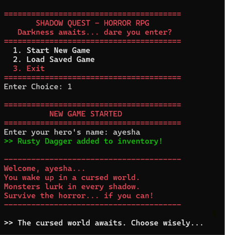
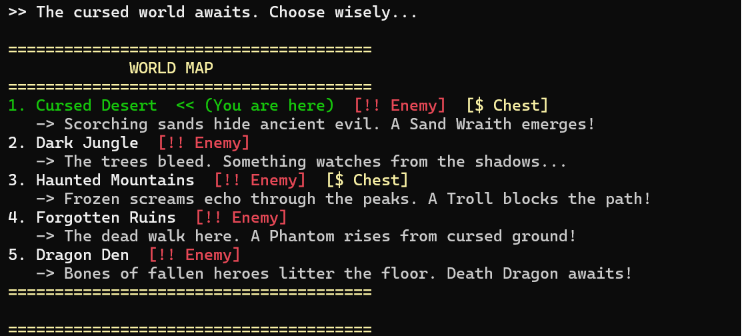
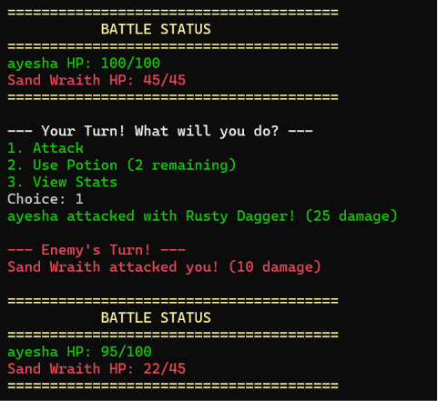
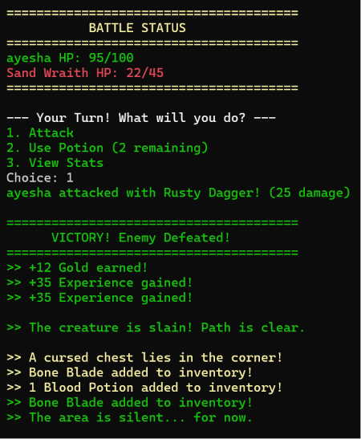
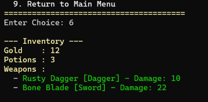
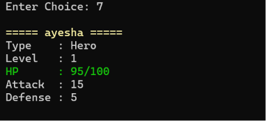

# Shadow Quest - Horror RPG 🎮

A text-based Horror RPG game built in C++ 
demonstrating all four OOP pillars.

## Features
- 🗺️ World Map with 5 locations
- ⚔️ Turn-based battle system
- 🎒 Inventory system (weapons & potions)
- 📊 Player stats (HP, Attack, Defense)
- 💰 Gold & XP rewards
- 💾 Save & Load game
- 👹 Final Boss - Dragon Den

## OOP Concepts Used
- Encapsulation
- Inheritance
- Polymorphism
- Abstraction

## How to Run
Compile in Dev C++ and run the executable.
## Screenshots

### Main Menu

### New Game

### World Map

### Battle
.png)

### Battle Status

### Victory

### Inventory

### Stats

